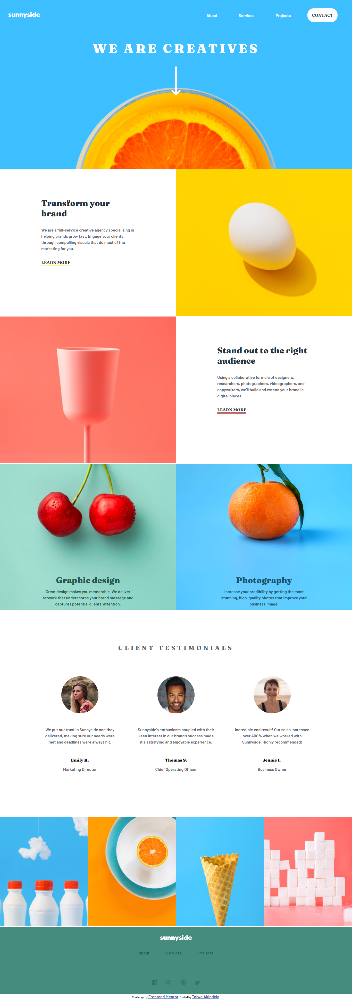

# Frontend Mentor - Sunnyside agency landing page solution

This is a solution to the [Sunnyside agency landing page challenge on Frontend Mentor](https://www.frontendmentor.io/challenges/sunnyside-agency-landing-page-7yVs3B6ef). Frontend Mentor challenges help you improve your coding skills by building realistic projects.

### The challenge

Users should be able to:

- View the optimal layout for the site depending on their device's screen size
- See hover states for all interactive elements on the page

### Screenshot

### Links

- Solution URL: [Add solution URL here](https://your-solution-url.com)
- Live Site URL: [Add live site URL here](https://your-live-site-url.com)

### Built with

- Semantic HTML5 markup
- CSS custom properties
- Flexbox
- CSS Grid
- Mobile-first workflow
- [Styled Components](https://styled-components.com/) - For styles

### What I learned

This project reinforces my use of CSS grid and also CSS flex. This is a practice project to reinforce my knowldege.

## Author

- Website - [Taiwo Akindele]
- Frontend Mentor - [@taiwoAkindele](https://www.frontendmentor.io/profile/taiwoAkindele)
- Twitter - [@Taiiiiwo](https://twitter.com/Taiiiiwo)
